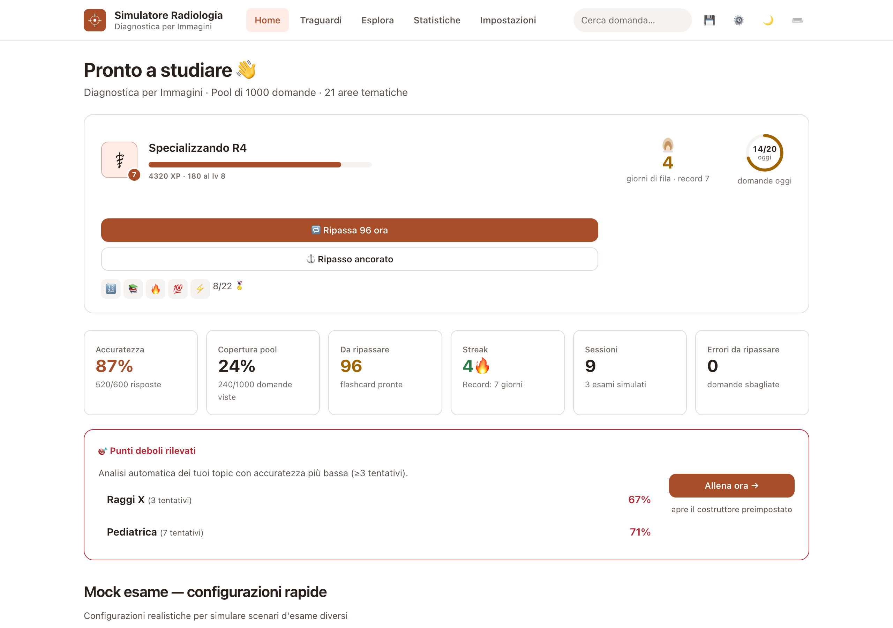
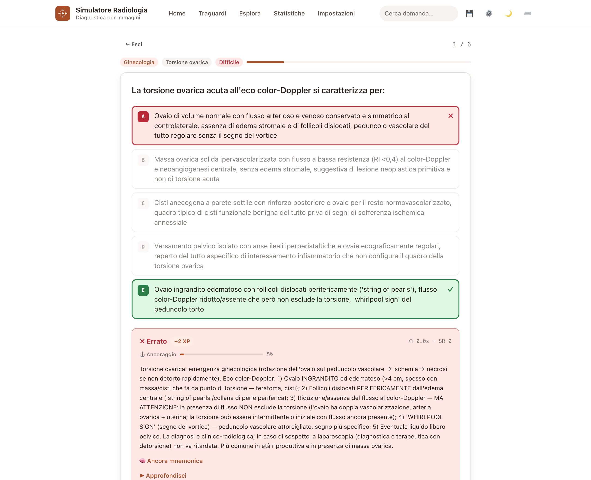
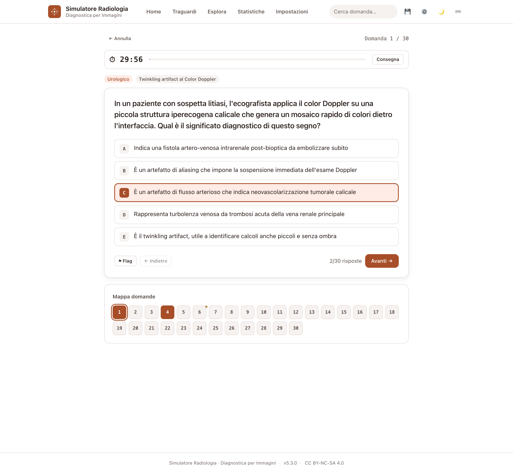
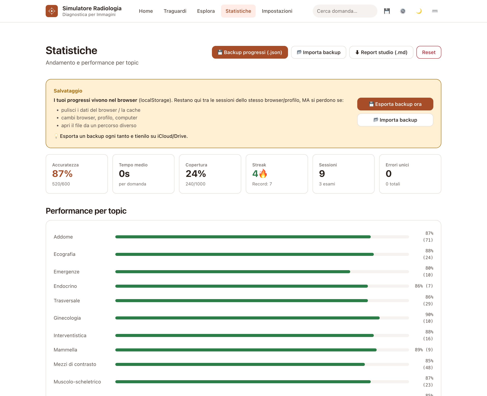
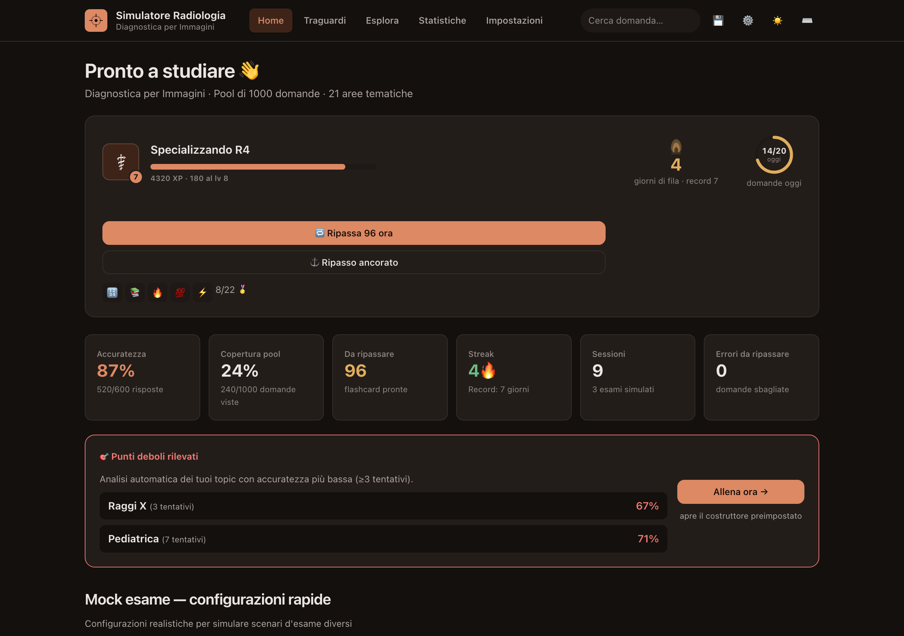

# Simulatore Radiologia · Esame DPI

Simulatore per l'esame universitario di **Diagnostica per Immagini** (Radiologia).

Single-file HTML, **completamente offline-capable**, **nessuna dipendenza esterna**, niente CDN, niente font da internet. I progressi vivono in `localStorage` del browser.

> **Formato d'esame** tipico della prova scritta: risposta multipla con **una sola corretta**, **30 minuti**, voto in trentesimi arrotondato per eccesso, **soglia 18/30**. Il preset *Esame ufficiale* riproduce questo formato e mostra il voto stimato in trentesimi.

## Anteprima

| Home | Studio (feedback) |
|---|---|
|  |  |

| Esame simulato (timer + mappa) | Statistiche per topic |
|---|---|
|  |  |

| Tema scuro |
|---|
|  |

## Avvio rapido

### Opzione 0 — Un solo file da condividere (più semplice)

Il simulatore è **un singolo file HTML autosufficiente**: per condividerlo basta inviare `index.html` (rinominalo pure, es. `Simulatore-Radiologia.html`) via AirDrop, email o chat. Chi lo riceve fa **doppio click** e parte subito, **anche offline** — nessuna installazione, nessuna connessione.

> Nota: aperto con doppio click (`file://`) i progressi si salvano nel browser; su Safari il salvataggio può essere limitato in `file://`, usa Chrome/Firefox oppure una delle opzioni con server qui sotto.

### Opzione 1 — Doppio click (consigliata)

Doppio click su **`Avvia Simulatore.command`** dal Finder.

Si apre il Terminale, parte un server Python su una porta libera tra 8765-8780 (evita conflitto con altri progetti), il browser si apre automaticamente.

Per fermare: `Ctrl+C` nel Terminale o chiudilo.

### Opzione 2 — Doppio click su `index.html`

Funziona ma `localStorage` può essere limitato in Safari quando si apre con `file://`. Usa Chrome/Firefox se preferisci questa modalità.

### Opzione 3 — Server manuale

```bash
cd "Simulatore codice"
python3 -m http.server 8765 --bind 127.0.0.1
open http://127.0.0.1:8765/index.html
```

## Caratteristiche

### Contenuto
- **1000 domande** italiane su 21 topic del programma (Radiobiologia, Raggi X, TC, RM, Ecografia, Mdc, RX Torace, Toracico, Addome, Neuro, Muscoloscheletrico, Mammella, Urologico, Endocrino, Ginecologia, Emergenze, Pediatrica, Interventistica, Vascolare, Nucleare, trasversali…)
- **Spiegazione esaustiva + deep dive** clinico-fisiopatologico per **ogni** domanda (media ~760 + ~1080 caratteri), fondate sul materiale reale del corso e verificate
- **120 quesiti livello-esame** (hard/medium) generati dal materiale d'esame e revisionati in modo avversariale per accuratezza medica
- **Anti-ripetizione**: ricorda le ultime ~140 domande proposte e ruota su tutto il pool (niente più "sempre le stesse")
- **Preferenza di difficoltà** ("Livello difficoltà": Esame · Bilanciato · Graduale) — *Esame* di default per allenarti al livello reale

### 🎮 Gamification (motivazione quotidiana)
- **XP e 15 livelli** a tema carriera radiologica (Matricola → Specializzando R1-R5 → Radiologo → Primario → Leggenda)
- **Streak con fiamma animata** che cresce d'intensità (1+, 7+, 30+ giorni) + **obiettivo giornaliero** con anello di progresso
- **Combo** di risposte corrette → moltiplicatore XP; **22 medaglie** sbloccabili
- **Animazioni celebrative**: level-up, sblocco medaglia, confetti
- Vista **Traguardi** con livello, statistiche di gioco e galleria medaglie

### 🧠 Ancoraggio mentale (palazzo della memoria)
- **Ancora mnemonica per ogni area** (metodo dei loci: luogo + immagine vivida + gancio) mostrata durante lo studio
- **Misuratore di forza di ancoraggio** per ogni concetto (quanto è consolidato in memoria)
- **Ripasso ancorato**: sessione SR che dà priorità ai concetti più fragili e li rinforza con l'ancora
- Vista **Palazzo della Memoria** con tutte le ancore e il consolidamento per area

### Modalità di studio
- **Costruttore sessione personalizzata** 🎛️ — combina multi-topic, multi-difficoltà, n. domande, modo (studio/esame/flashcard), filtri (solo errori, flagged, SR-dovute)
- **Mock esame** con 4 preset realistici: **esame ufficiale** (30 dom/30 min), mini quiz (15/20), esame completo (60/90), sprint hard (20 dom difficili/20 min)
- **Voto in trentesimi** a fine esame: scala 0–30 arrotondata per eccesso, soglia 18 evidenziata, lode con punteggio pieno
- **Studio rapido** con bilanciamento automatico per topic
- **Esame simulato** con timer, mappa domande, review completa alla fine
- **Flashcard SR** con algoritmo SM-2 adattato (spaced repetition)

### Analisi performance
- **Vista "Punti deboli"** 🎯 — analisi automatica dei 3-5 topic con accuratezza più bassa (≥3 tentativi), bottone "Allena ora" preimpostato
- **Grafico SVG trend** accuratezza ultime 30 sessioni (inline, no librerie esterne)
- **Heatmap per topic** con accuratezza colore-codificata
- **Statistiche complete**: streak, copertura pool, errori unici, tempo medio, storico sessioni
- **Search highlight** evidenzia il termine cercato nelle domande
- **Export Markdown** completo dei progressi

### Persistenza & affidabilità (v5)
- **Recupero da stato corrotto**: se i dati salvati non si caricano, vengono messi in quarantena e ripristinati da uno **snapshot di sicurezza** ("ultimo stato buono")
- **Error boundary globale**: un errore in una vista non lascia mai la pagina bianca; schermata di recupero con "Torna alla home / Esporta backup / Ricarica"
- **Self-test del pool al boot** + **flush automatico** alla chiusura della scheda + **guardia multi-scheda**
- **Crash recovery esame**: se chiudi il browser durante un esame, alla riapertura ti chiede se riprenderlo (snapshot sanificato)
- **Backup/restore** progressi come file JSON (completo di XP/livelli/badge) con validazione, conferma annullabile e **rollback** se l'import fallisce
- **Salvataggio automatico** con indicatore di stato e avviso se localStorage è pieno

### UX — design "Strumento clinico" (v5.1)
- **Design clinico-minimale**: bianco pulito, un accento terracotta, tipografia di sistema, scala tipografica e spaziatura armoniche (vedi [`DESIGN.md`](DESIGN.md))
- **Dark mode** "sala di lettura" con contrasto WCAG AA verificato per pixel
- **Ricerca** in tempo reale (non interrompe sessioni attive)
- **Scorciatoie tastiera** (1-5, Enter, F, D, /, ?) che ignorano i modificatori del browser
- **Mobile-friendly** (tap target ≥44px)
- **Accessibility** (role="status", aria-live, brand tab-navigable, reduced-motion)

## Persistenza progressi — tre livelli di protezione

1. **Automatica**: ogni risposta salvata in `localStorage` del browser
2. **Backup manuale**: pulsante 💾 in header → file `radiologia-progressi-AAAA-MM-GG.json` scaricabile
3. **Reminder**: ogni 5 sessioni completate, popup che invita a esportare un backup

Se cambi browser/computer/profilo, basta importare l'ultimo `.json` per ripristinare i progressi.

## Scorciatoie tastiera

| Tasto | Azione |
|---|---|
| `1`-`5` | Rispondi A-E |
| `Enter` | Avanti alla prossima domanda |
| `F` | Flag/unflag la domanda corrente |
| `D` | Mostra/nascondi approfondimento (deep dive) |
| `/` | Focus barra di ricerca |
| `?` | Mostra/nascondi pannello scorciatoie |

## File del progetto

```
Simulatore codice/
├── index.html              # Il simulatore (single-file, ~1,8 MB) — condividi questo
├── dist/index.html         # Copia "build" per il deploy
├── Avvia Simulatore.command # Launcher macOS doppio click
├── README.md               # Questo file
├── DESIGN.md / PRODUCT.md  # Sistema di design e contesto di prodotto
├── CHANGELOG.md            # Storico versioni
├── docs/screenshots/       # Screenshot dell'app (usati qui sopra)
├── scripts/                # validate_pool.cjs, dev_server.cjs, rebalance.py
├── validate.sh             # Validazione integrità del pool/JS prima del deploy
└── .gitignore              # Ignora backup .json e file di sistema
```

## Sviluppo

Il file `index.html` contiene:
- Pool domande in 6 blocchi `<script>` che pushano su `window.__QPOOL__`
- Logica SR, render, storage in un unico blocco JS finale
- CSS embedded con variabili per dark mode

Per modificare: edita `index.html` direttamente. Per validare il JS rapidamente:

```bash
node -e "
const fs=require('fs');
const html=fs.readFileSync('index.html','utf8');
[...html.matchAll(/<script>([\\s\\S]*?)<\\/script>/g)].forEach((m,i)=>{
  try { new Function(m[1]); console.log('Block',i,'OK'); }
  catch(e){ console.error('Block',i,'FAIL:',e.message); }
});"
```

## Crediti

Domande basate su:
- Compiti fotografati durante l'anno accademico (verificate)
- File Word "domande final boss" (raccolta studenti)
- Materiale didattico del corso
- Linee guida ATS/ERS, ACR, AJCC 8a ed., LI-RADS, BI-RADS, PI-RADS, ASAS, RECIST 1.1, BCLC

## Licenza

Uso personale per studio. Le domande sono materiale derivato da fonti didattiche pubbliche.
